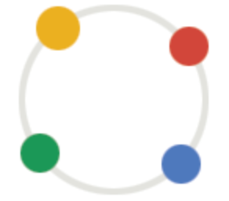

<!--
*** Thank you for checking this Readme.
*** Please feel free to ask issues or contact me.
-->

<!-- PROJECT SHIELDS -->
[![Contributors][contributors-shield]][contributors-url]
[![Forks][forks-shield]][forks-url]
[![Stargazers][stars-shield]][stars-url]
[![Issues][issues-shield]][issues-url]
[![MIT License][license-shield]][license-url]

<!-- PROJECT LOGO -->
 

<h3 align="center">Beauty Bookmark</h3>

Beautify your new tab with nested bookmark lists!
 
<a href="https://twitter.com/ryuta005"><strong>Follow Twitter »</strong></a>
 
 
<a href="https://www.linkedin.com/in/koheimurakami1994/">LinkedIn</a>
·
<a href="https://www.wantedly.com/users/96859782">Wantedly</a>
·
<a href="https://qiita.com/ryuta69">Qiita</a>

<!-- TABLE OF CONTENTS -->
## Table of Contents

* [About the Project](#about-the-project)
  * [Built With](#built-with)
* [Installation](#installation)
* [Contributing](#contributing)
* [License](#license)
* [Contact](#contact)
* [Reference](#reference)

<!-- ABOUT THE PROJECT -->
## About The Project

There are many great bookmark extension available, however, I didn't find one that really suit my needs so I created this enhanced one.
Here's differences:
* Beautifully Tree your Bookmarks in new tab.

### Built With
* [Google Extension](https://developer.chrome.com/extensions/overview)

<!-- INSTALLATION -->
## Installation
Get extension at [Not Available Yet](https://example.com)

### Developer
1. Clone this Repository.
2. Open "Setting" > "Extension" on chrome browser.
3. Turn on "Developer mode" on right above.
4. Click "Load unpackaged extension" button.
5. Load downloaded repository.

<!-- CONTRIBUTING -->
## Contributing

1. Fork the Project
2. Create your Feature Branch (`git checkout -b feature/AmazingFeature`)
3. Commit your Changes (`git commit -m 'Add some AmazingFeature'`)
4. Push to the Branch (`git push origin feature/AmazingFeature`)
5. Open a Pull Request

<!-- LICENSE -->
## License

Distributed under the MIT License. See [LICENSE](https://github.com/ryuta69/beauty-bookmark/blob/master/LICENSE.txt) for more information.

<!-- CONTACT -->
## Contact

Kohei Murakami - [@ryuta005](https://twitter.com/ryuta005) / eyma22s.yu@gmail.com

<!-- REFERENCE -->
## Reference

* [Chrome拡張機能の作成方法](https://www.casleyconsulting.co.jp/blog/engineer/79/)

<!-- MARKDOWN ARGUMENT -->
[contributors-shield]: https://img.shields.io/github/contributors/ryuta69/beauty-bookmark.svg?style=flat-square
[contributors-url]: https://github.com/ryuta69/beauty-bookmark/graphs/contributors
[forks-shield]: https://img.shields.io/github/forks/ryuta69/beauty-bookmark.svg?style=flat-square
[forks-url]: https://github.com/ryuta69/beauty-bookmark/network/members
[stars-shield]: https://img.shields.io/github/stars/ryuta69/beauty-bookmark.svg?style=flat-square
[stars-url]: https://github.com/ryuta69/beauty-bookmark/stargazers
[issues-shield]: https://img.shields.io/github/issues/ryuta69/beauty-bookmark.svg?style=flat-square
[issues-url]: https://github.com/ryuta69/beauty-bookmark/issues
[license-shield]: https://img.shields.io/github/license/ryuta69/beauty-bookmark.svg?style=flat-square
[license-url]: https://github.com/ryuta69/beauty-bookmark/blob/master/LICENSE.txt
